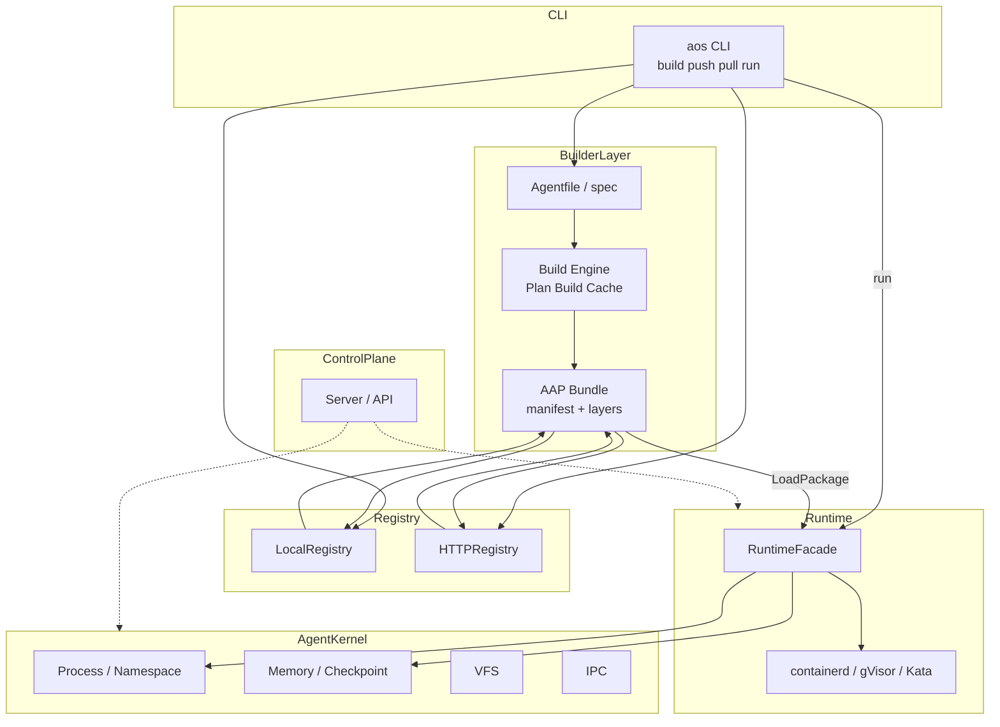

<p align="center">
  
</p>

<h1 align="center">OpenOS</h1>

<p align="center">
  <a href="https://github.com/deepelementlab/clawcode/releases">
   
  </a>
  <a href="#license"></a>
</p>

**System goal:** realize **AOS** — an **Agent Operating System** — the layer that gives autonomous software agents the same primitives a classical OS gives processes: **lifecycle, isolation, scheduling, namespaces for tenancy, messaging, and observability**, exposed primarily through **APIs**, not GUIs.


**What “AOS” means:** **AOS** abbreviates **Agent Operating System** — the architectural north star of treating **agents** as first-class units (create, schedule, run, recover, retire) with **consistent persistence and events** (for example outbox-style delivery) so behavior stays explainable under failure. **OpenOS** is the open project and codebase that implements this AOS vision.

**The control plane for long-running AI agents** — not a chat wrapper. OpenOS is an **API-first, cloud-native runtime layer** that treats agents like the OS treats processes: **lifecycle, isolation, scheduling, multi-tenancy, events, and observability** under one contract.

- **Agent-native** — Built for agents that run 24/7, call APIs, and coordinate over messages—not for point-and-click GUIs.
- **Honest architecture** — Extensive design docs (SLOs, ADRs, compatibility matrix, thin data layer) plus a **Go reference implementation** you can build and test today.
- **Production-minded** — Dual state machines (control plane + outbox), idempotent APIs, tenant quotas, NATS-oriented messaging, and tests from unit to e2e.

---

## What OpenOS is — and is not

| OpenOS **is** | OpenOS **is not** |
|-----------------|---------------------|
| Infrastructure to **run, schedule, and isolate** agents with a real control plane | A single-model **LLM SDK** or prompt toolkit |
| A **layered platform** (interface → orchestration → agent runtime → platform → core services) | A hosted SaaS product (this repo is **code + specs**) |
| A place to attach **gRPC/HTTP**, **PostgreSQL**, **NATS**, **container runtimes** | A finished “drop in prod with zero ops” appliance |

---

## Why OpenOS exists

Traditional stacks assume **human-driven** sessions. Agents need **continuous execution**, **predictable resources**, **strong isolation**, and **machine-readable contracts**. Teams stitching together ad-hoc scripts, containers, and queues hit the same walls: **no unified lifecycle**, **weak tenant boundaries**, **inconsistent retries**, and **no shared observability model**.

OpenOS answers with:

1. **One lifecycle model** — From create → schedule → start → ready/fail, with compensation paths spelled out.
2. **One consistency story** — Persisted state + outbox-style delivery so “published” means something under failure.
3. **One front door** — REST/gRPC/WebSocket direction with shared errors, idempotency, and versioning (see architecture docs).
4. **Multi-tenancy by design** — Tenant context, quotas, and interceptors on the API path (where implemented).
5. **Ops you can reason about** — SLI/SLO targets, error budgets, and CI data gates documented—not an afterthought.

---

## Key capabilities (implementation + design)

The Go module under `agent-os/implementation` (`github.com/agentos/aos`, Go **1.22+**) includes:

| Area | What you will find |
|------|---------------------|
| **CLI & process** | Cobra-based **`aos`** binary: config path (`-c`/`--config`, default `config.yaml`), debug flag, graceful shutdown. |
| **HTTP control plane** | Server package with health/metrics-style endpoints and middleware; baseline for MVP gateway (ADR: in-process first, Envoy as target). |
| **gRPC** | Agent and tenant services, protobuf v1 APIs, interceptors for **auth**, **tenant**, **quota**, **metrics** (see `api/grpc`, `api/proto`). |
| **Agent runtime** | CRI-style abstractions; **containerd** integration; **gVisor** / **Kata** packages and tests toward sandboxed execution. |
| **Orchestration** | Workflow engine, **saga** coordinator, state machine transitions, compensation paths—**with tests**. |
| **Discovery** | Registry-style discovery with **round-robin / least-conn / weighted** balancers and tests. |
| **Scheduling** | Scheduler interfaces and **failover-oriented** scheduling code paths with tests. |
| **Data & migrations** | PostgreSQL-oriented **migration manager**, connection pool/retry helpers, repositories (e.g. agent, tenant), extended data repository patterns. |
| **Messaging** | NATS client wrappers, publisher/subscriber, routing, serde, deliverer—**with tests**. |
| **Security hooks** | OPA client scaffolding and policy-oriented tests (policy as code direction). |
| **Quality** | `go test` across packages; **race** in Makefile test targets; **benchmarks** (`test/benchmarks`); **smoke** and **e2e** tests. |

**Thin data layer (design):** repositories, Unit of Work, outbox, schema registry, and migrations—without a separate “data microservice” in early phases. See [`agent-os/architecture/data-layer-blueprint.md`](agent-os/architecture/data-layer-blueprint.md).

---

## Status at a glance

Rough classification for expectations (always check the code for ground truth):

| Tier | Examples |
|------|----------|
| **Shipped in tree** | CLI, HTTP server skeleton, gRPC surfaces + interceptors, DB migrations/pool, NATS messaging packages, orchestration workflow/saga tests, discovery balancers, runtime packages (containerd/gVisor/Kata paths), benchmarks, e2e/smoke tests. |
| **In progress** | Full production hardening, end-to-end story for every API on real clusters, complete scheduler policies, universal OPA rollout. |
| **Planned / target** | Envoy-class gateway control plane, Temporal/Argo-class external workflow engine if adopted, Kafka for selected high-throughput streams, full SLO dashboards wired to releases. |

**Current version label:** **v0.1.0** (see `VERSION` in [`agent-os/implementation/Makefile`](agent-os/implementation/Makefile)).

---

## Architecture at a glance

OpenOS is described as **five logical layers** plus an explicit **thin data layer** and **dual state machines** (control vs. consistency). Diagrams render on GitHub (Mermaid).

### Logical layers (north–south)



---

## Design principles (short)

1. **API-first** — OpenAPI/gRPC-friendly contracts, unified errors, idempotency keys, `/api/v1/...` style versioning.
2. **Agent-centric** — Schedulers and lifecycle follow agents, not interactive users.
3. **Security by design** — Tenants, quotas, isolation (namespaces/cgroups/sandboxes) as first-class concepts.
4. **Cloud-native** — Containers, horizontal patterns, observable by default (`trace_id`, `agent_id`, `tenant_id` in events).
5. **Governance** — Capabilities tracked as **Target / IterationScope / Implemented** with evidence—not wishful labeling.

**ADRs (examples):** in-process gateway for MVP with a path to Envoy; **NATS-first** messaging with optional JetStream. See [`agent-os/architecture/adr/`](agent-os/architecture/adr/).

---

## Tech stack (reference)

| Layer | Technologies |
|--------|----------------|
| Language | **Go** 1.22+ |
| APIs | **gRPC**, **grpc-gateway** (optional REST bridge), HTTP (`net/http` / server package) |
| Data | **PostgreSQL** (sqlx), **Redis** client present for cache/session style configs |
| Messaging | **NATS** (`nats.go`) |
| Runtime | **containerd**, **gVisor**, **Kata** directions in tree |
| Observability | Zap logging; Prometheus-style hooks in design docs |
| CLI | **Cobra**, **Viper** |

---

## Quick start

From the **implementation** module:

```bash
cd agent-os/implementation
go mod download
make build          # output: bin/aos
```

Run with the sample config (adjust DB/Redis/NATS to your environment):

```bash
./bin/aos --config configs/config.yaml
# or: go run ./cmd/aos --config configs/config.yaml
```

**Tests:**

```bash
# Full module test (recommended for contributors)
go test -race ./...

# Makefile shortcut (pkg + internal packages)
make test
```

Some integration paths expect **PostgreSQL**, **Redis**, or **NATS** to be available; if a test fails on connection, check env-specific `test` or `e2e` packages and your local services.

**Other Makefile targets:** `make lint`, `make coverage`, `make run`, cross-builds `build-linux` / `build-darwin` / `build-windows`. See [`agent-os/implementation/Makefile`](agent-os/implementation/Makefile).

---

## Repository layout

```text
.
├── README.md                 # This file
└── agent-os/
    ├── architecture/       # System + technical architecture, SLOs, CI gates, ADRs, compatibility matrix
    ├── technical-design/     # API specs, deep design, database schema notes
    ├── implementation/       # Go module: cmd/, internal/, api/, pkg/, configs/, test/
    ├── product-vision.md     # Product definition
    └── …                     # Planning, business, archive docs
```

---

## Documentation map

| Topic | Location |
|--------|----------|
| System overview | [`agent-os/architecture/system-architecture.md`](agent-os/architecture/system-architecture.md) |
| Detailed technical architecture | [`agent-os/architecture/tech-architecture.md`](agent-os/architecture/tech-architecture.md) |
| API compatibility (REST/gRPC/WS) | [`agent-os/architecture/api-compatibility-matrix.md`](agent-os/architecture/api-compatibility-matrix.md) |
| SLOs and release gates | [`agent-os/architecture/slo-release-gate.md`](agent-os/architecture/slo-release-gate.md) |
| CI data gates | [`agent-os/architecture/ci-data-gates.md`](agent-os/architecture/ci-data-gates.md) |
| Product summary | [`agent-os/summary-overview.md`](agent-os/summary-overview.md) |

---

## Reliability and shipping (documented targets)

SLI/SLO examples (targets, not guarantees until measured in your deployment): agent start success and latency, API error rate, outbox delivery success, event ACK latency—with **error budget** rules tying breaches to release policy. Data-related releases add migration safety, schema compatibility, and idempotency tests. See the SLO and CI gate documents linked above.

---

## Added:

- Agent construction / assembly / customization.

- System core runtime abstraction.

- Standardized Agent delivery – similar to Docker image-based container delivery.

- Reusable Agent components – template inheritance + dependency reuse.

- CI/CD integration – Agent builds can be integrated into DevOps pipelines.

- Version management – versioned and traceable Agent artifacts.

---

## Contributing

Issues and pull requests are welcome. Please run **`go test -race ./...`** (and `make lint` if you use golangci-lint) before submitting. For large behavior changes, align with an ADR or architecture note when appropriate.

---

## License

GPL-3.0
