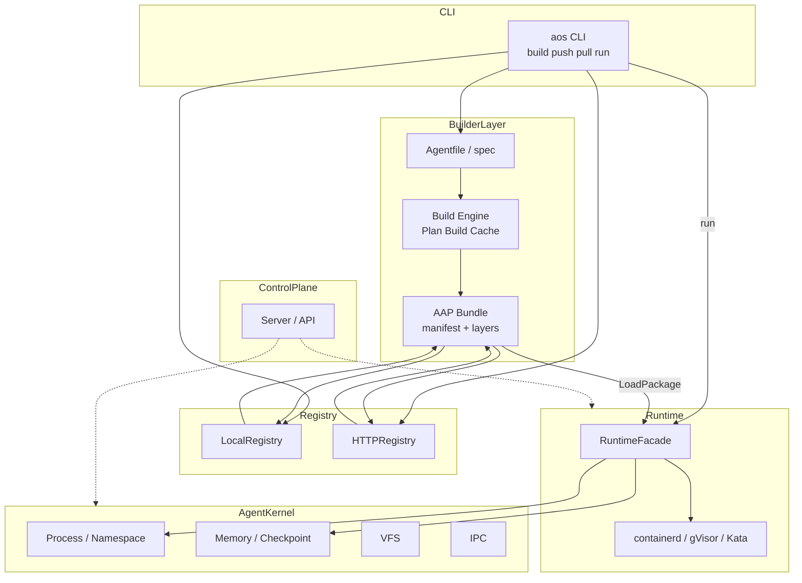

<p align="center">
  
</p>

<h1 align="center">OpenOS</h1>

<p align="center">
  <a href="https://github.com/deepelementlab/clawcode/releases">
   
  </a>
  <a href="#license"></a>
</p>

OpenOS aims to build an open AOS (Agent Operating System) that provides a complete closed loop — from definition to runtime — for long-running agent workloads, supporting the entire lifecycle from development and delivery to production operations.


AOS separates the agent lifecycle into two evolvable tracks—build & distribution and run & management—and joins them with a single, portable artifact: the Agent Package (AAP).

**1. Engineering-friendly construction of Agent artifacts**
Using a declarative Agentfile to describe metadata, build steps, and multi-stage builds, developers can produce standardized AAP (Agent Package) via the aos build command. With aos push / aos pull and local or HTTP registries, teams can manage versioning and distribution. The system supports dependency declaration, package signing, and other mechanisms, enabling agent applications to be built, published, and traced just like cloud-native artifacts.

**2. Unified runtime and management environment**
Based on the RuntimeFacade that interfaces with runtimes such as containerd, gVisor, and Kata, combined with the Agent Kernel's abstractions over process groups, namespaces, memory and checkpoints, VFS, IPC, and more — along with the aos run command and control plane services — OpenOS provides management capabilities for starting, isolating, lifecycle, and observability of agents. This allows both "packages" and "running instances" to be operated under a unified semantic model.

---

## Design philosophy

We define what the package is first, then how it runs. The package (manifest + layers + mapping rules) bridges build-time and run-time instead of hard-coding build steps into process isolation or vice versa.


|       Track       |       Intent        |  Examples |
|-------------------|---------------------|-----------|
| **Build & Distribution** | Turn an agent application into a versioned, addressable, reusable unit | internal/builder/spec, engine (Plan / Build, multi-stage & DAG), registry (local / HTTP), deps |
| **Run & Management** | Run agents as isolated, kernel-aware workloads on mainstream runtimes | pkg/runtime/facade, internal/kernel (process / memory / vfs / ipc), cmd/aos run, internal/server and control-plane packages |

### 1. Build & distribution
#### a. Declarative first
The Agentfile (JSON/YAML) carries apiVersion, metadata, steps/stages, dependencies, etc. The build plan is derived from spec → Plan, not hardcoded in the CLI.

**Implementation:** internal/builder/spec defines the schema; engine.Plan / PlanMultiStage, topological sorting, and parallel stages translate "intent" into computable, cacheable layer hashes and stage digests.

**Core Idea:** Agent deliverables should be reviewable, diffable, and CI-integratable, drawing a clear line from "ad-hoc scripting."

#### b. Package as Contract
The output is an AAP (manifest.json, layers.json, etc.). Together with Registry push/pull, the "single source of truth" within a team becomes the artifact + version, not a directory on some machine.

**Implementation:** engine.WriteLocalAAP, registry.LocalRegistry / HTTPRegistry, LoadAgentPackage.

**Core Idea:** Operations and collaboration are bounded by artifacts; the runtime environment only consumes the contract and does not re-implement build logic.

#### c. Security and Trust Boundary (Optional but Structured)
Signatures (e.g., registry/crypto, signature.json) incorporate provenance and integrity into the same artifact model, rather than as an afterthought.

**Core Idea:** The trust chain between distribution and production is productized, not relying solely on network isolation.

#### d. Content-Addressable Layers
Layer hashing, cache directories (e.g., LayerCache), multi-stage From / dependsOn are consistent with the intuition of multi-stage builds + layer reuse for container images.

**Implementation:** Computing digests per step/stage in the engine, DAG parallel execution hooks, caching metadata (including extension points for linking with Kernel checkpoints).

**Core Idea:** Build acceleration and reproducibility depend on hashable units, not on the state of a specific builder machine.

### 2. Run & management
#### a. Runtime vs. Kernel Layering
RuntimeFacade is responsible for interfacing with the "container/sandbox world" (e.g., containerd, gVisor, Kata) via CreateAgent, StartAgent, etc.

Kernel Facade is responsible for "Agent OS semantics" like process groups, namespaces, memory regions & checkpoints, VFS, IPC, decoupled from concrete container implementations.

**Implementation:** pkg/runtime/facade + WithKernel; subsystems under internal/kernel; aos run pulls the package → parses manifest → hooks into Kernel during CreateAgent.

**Core Idea:** The container runtime solves "how to run a container"; the Kernel layer expresses "how an agent is managed as a system resource." The two are composed, not merged into a monolithic runtime blob.

#### b. Single Entrypoint, Multiple Backends (Facade + Pluggable Backends)
The runtime uses a factory + interface (interfaces.Runtime) to switch implementations; the CLI/API side converges call paths through the Facade.

**Core Idea:** Replaceable backends and testability (e.g., mock/noop also exist in paths like gRPC) prevent the control plane from binding to any vendor-specific runtime.

#### c. Explicit Mapping from Package to Process (Explicit mapping from AAP to AgentSpec)

LoadAgentPackage + AgentSpecFromPackage (pkg/runtime/facade/package.go) maps the config/entrypoint from the manifest to types.AgentSpec, which is then passed to Connect / CreateAgent.

**Core Idea:** Runtime parameters come from the artifact, avoiding implicit configuration guessing at runtime, which benefits auditing and reproducibility.

### 3. Closing the loop
The path aos build → Registry → aos run (and the broader control plane) reflects a package-driven agent OS:

- Build produces a unique artifact;

- The Registry provides addressing and distribution;

- Runtime consumes the same manifest and layers on the dual capabilities of the Kernel + Runtime.

Building (defining + building + distributing) and running (isolation + lifecycle + observability) are designed to be symmetric, traceable, and automatable, delivering an "artifact-driven Agent OS."


---

## Key capabilities

AOS combines **declarative agent packages** (build → registry) with **runtime and kernel-level execution**, so agents can be **packaged, distributed, and run** under a consistent control-plane model.
| Area | Capability | What you get (implementation-backed) |
|------|------------|----------------------------------------|
| **CLI** | Unified `aos` tool | `build`, `push`, `pull`, `run` (plus `server` and other commands under `cmd/aos`) for artifact and control-plane workflows. |
| **Agent packages** | Declarative **Agentfile** | JSON/YAML manifests (`internal/builder/spec`): metadata, `steps`, multi-stage **`stages`**, `from` / `dependsOn`, dependencies, config, entrypoint. |
| **Build engine** | Plan → build → AAP | Content-addressable layer digests, **multi-stage** plans, **DAG**-ordered stages with parallel hooks (`internal/builder/engine`). Output **AAP** layout (`manifest.json`, `layers.json`, …). |
| **Build cache** | Layer cache | Filesystem-backed **layer cache** with sharded paths and pruning (`LayerCache` in `internal/builder/engine`). |
| **Checkpoints (build path)** | Kernel-integrated metadata | Optional **memory checkpoint** IDs attached to cache metadata when using kernel test/build hooks (`checkpoint.go`, `MemoryManager`). |
| **Registry** | Local registry | File-based store and index under a root directory (`internal/builder/registry`). |
| **Registry** | HTTP registry | Push/pull over HTTP with optional **Bearer** token (`HTTPRegistry` in `internal/builder/registry/remote.go`). |
| **Trust** | Package signing | **Ed25519** sign/verify and `signature.json` sidecar (`internal/builder/registry/crypto.go`). |
| **Dependencies** | Resolver | In-memory resolution of `DependencySpec` (agents with `ref`, services, volumes) (`internal/builder/deps`). |
| **Runtime facade** | Single entry to runtimes | **`RuntimeFacade`**: backend selection, `Connect`, `CreateAgent`, `StartAgent`, optional **`WithKernel`** (`pkg/runtime/facade`). |
| **Runtime backends** | Pluggable runtimes | **containerd**, **gVisor**, **Kata** packages under `pkg/runtime/` with shared `interfaces` and `types`. |
| **Agent mapping** | AAP → `AgentSpec` | **`AgentSpecFromPackage`** maps manifest to `types.AgentSpec` for create/start (`pkg/runtime/facade/package.go`). |
| **Agent kernel** | OS-style primitives | **Process** (groups, namespaces), **memory** (regions, checkpoint/restore stubs), **VFS**, **IPC** (`internal/kernel/*`), aggregated by **`kernel.Facade`**. |
| **Control plane** | HTTP & gRPC APIs | Server wiring (`internal/server`), **gRPC** services and **protobuf** under `api/grpc` and `api/proto`, optional **gRPC-Gateway**. |
| **Platform features** | Multi-tenant & ops | Scheduling, orchestration, messaging (e.g. **NATS**), discovery, tenant/quota, observability hooks—see `internal/` subsystems (aligned with `go.mod` dependencies). |
| **Persistence & cache** | Data stack | **PostgreSQL** (`lib/pq`, `sqlx`), **Redis**, storage abstractions (`internal/database`, `internal/storage`). |
| **CI & quality** | Automation | **GitHub Actions**, tests with race detector and coverage, optional **Codecov**; scripts for **key-package coverage** (`scripts/coverage-key-packages.sh` / `.ps1`). |

---

## System Architecture



---

## Design principles

1. **API-first** — OpenAPI/gRPC-friendly contracts, unified errors, idempotency keys, `/api/v1/...` style versioning.
2. **Agent-centric** — Schedulers and lifecycle follow agents, not interactive users.
3. **Security by design** — Tenants, quotas, isolation (namespaces/cgroups/sandboxes) as first-class concepts.
4. **Cloud-native** — Containers, horizontal patterns, observable by default (`trace_id`, `agent_id`, `tenant_id` in events).
5. **Governance** — Capabilities tracked as **Target / IterationScope / Implemented** with evidence—not wishful labeling.

**ADRs (examples):** in-process gateway for MVP with a path to Envoy; **NATS-first** messaging with optional JetStream.

---

## Repository layout

```text
├── cmd/aos/                 # aos CLI: control-plane server, build, push, pull, run, etc.
├── api/                     # Public-facing API surface
│   ├── gateway/             # HTTP gateway entry
│   ├── grpc/                # gRPC services and generated protobuf code (pb)
│   ├── proto/               # Protobuf definitions and buf configuration
│   ├── handlers/            # HTTP/gRPC handlers
│   ├── middleware/          # Cross-cutting concerns (auth, tenant, audit, …)
│   ├── auth/                # API-layer authentication helpers
│   ├── models/              # Request/response models
│   ├── routes/              # Route registration
│   └── specs/               # API specifications (e.g. OpenAPI)
├── internal/                # Non-exported application and domain logic
│   ├── server/              # HTTP server wiring, routing, middleware stack
│   ├── config/              # Configuration loading
│   ├── agent/               # Agent lifecycle and related logic
│   ├── scheduler/           # Scheduling (affinity, algorithms, failover, …)
│   ├── orchestration/       # Workflows, sagas, state machines
│   ├── messaging/           # Messaging, NATS integration, event bus
│   ├── discovery/           # Service discovery and load balancing
│   ├── tenant/              # Multi-tenancy and quotas
│   ├── database/            # DB connectivity, migrations, retries
│   ├── storage/             # Storage abstractions
│   ├── auth/                # Internal token and auth utilities
│   ├── security/            # Policy (e.g. OPA), supply chain, …
│   ├── monitoring/          # Metrics and observability helpers
│   ├── observability/tracing/  # Distributed tracing
│   ├── health/              # Health aggregation
│   ├── resource/            # Resource management
│   ├── network/             # Network policy
│   ├── deployment/          # Deployment pipeline–related logic
│   ├── federation/          # Federation / registry-style extensions
│   ├── resilience/          # Probes and resilience patterns
│   ├── slo/                 # SLO-related logic
│   ├── autoscaling/         # Autoscaling
│   ├── capacity/            # Capacity planning
│   ├── prediction/          # Fault prediction and related analytics
│   ├── governance/          # Billing and governance-style concerns
│   ├── edge/                # Edge-oriented extensions / placeholders
│   ├── ml/                  # ML-oriented extensions / placeholders
│   ├── validation/          # Stress/validation utilities
│   ├── audit/               # Auditing
│   ├── data/                # Internal data helpers
│   ├── version/             # Build/version metadata
│   ├── kernel/              # Agent kernel: process, memory, vfs, ipc
│   └── builder/             # Agent packages: spec, engine, registry, deps, integration tests
├── pkg/                     # Importable libraries (stable API intent varies by package)
│   ├── runtime/             # Container runtime abstraction and backends
│   │   ├── facade/          # RuntimeFacade (unified entry, AAP mapping helpers)
│   │   ├── interfaces/      # Runtime interfaces
│   │   ├── types/           # Shared runtime types
│   │   ├── containerd/      # containerd backend
│   │   ├── gvisor/          # gVisor backend
│   │   ├── kata/            # Kata backend
│   │   ├── sandbox/         # Sandbox and network isolation
│   │   ├── lifecycle/       # Lifecycle hooks
│   │   └── resource/        # Runtime resource enforcement
│   └── packaging/           # Manifest and packaging helpers
├── test/                    # Cross-package tests
│   ├── integration/         # Integration tests
│   ├── e2e/                 # End-to-end tests
│   ├── smoke/               # Smoke tests
│   ├── benchmarks/          # Benchmarks
│   └── data/                # Test fixtures
├── scripts/                 # Tooling (e.g. coverage helpers)
├── configs/                 # Sample or default configuration
├── docs/                    # Documentation (including OpenAPI assets)
├── sdk/go/                  # Go client SDK (or stubs)
├── data/                    # Local/sample data directories
├── bin/                     # Build output directory (when present)
├── .github/                 # CI workflows and composite actions (e.g. build-agent)
├── .devcontainer/           # Dev container configuration
├── go.mod / go.sum          # Go module definition
└── coverage*                # Local coverage artifacts (typically gitignored)
```

---

## Tech stack

| Layer | Technologies |
|--------|----------------|
| Language | **Go** 1.22+ |
| APIs | **gRPC**, **grpc-gateway** (optional REST bridge), HTTP (`net/http` / server package) |
| Data | **PostgreSQL** (sqlx), **Redis** client present for cache/session style configs |
| Messaging | **NATS** (`nats.go`) |
| Runtime | **containerd**, **gVisor**, **Kata** directions in tree |
| Observability | Zap logging; Prometheus-style hooks in design docs |
| CLI | **Cobra**, **Viper** |

---

## Quick start

From the **implementation** module:

```bash
cd agent-os/implementation
go mod download
make build          # output: bin/aos
```

Run with the sample config (adjust DB/Redis/NATS to your environment):

```bash
./bin/aos --config configs/config.yaml
# or: go run ./cmd/aos --config configs/config.yaml
```

**Tests:**

```bash
# Full module test (recommended for contributors)
go test -race ./...

# Makefile shortcut (pkg + internal packages)
make test
```

Some integration paths expect **PostgreSQL**, **Redis**, or **NATS** to be available; if a test fails on connection, check env-specific `test` or `e2e` packages and your local services.

**Other Makefile targets:** `make lint`, `make coverage`, `make run`, cross-builds `build-linux` / `build-darwin` / `build-windows`.

---

## Added:

- Agent construction / assembly / customization.

- System core runtime abstraction.

- Standardized Agent delivery – similar to Docker image-based container delivery.

- Reusable Agent components – template inheritance + dependency reuse.

- CI/CD integration – Agent builds can be integrated into DevOps pipelines.

- Version management – versioned and traceable Agent artifacts.

---

## Contributing

Issues and pull requests are welcome. Please run **`go test -race ./...`** (and `make lint` if you use golangci-lint) before submitting. For large behavior changes, align with an ADR or architecture note when appropriate.

---

## License

GPL-3.0
