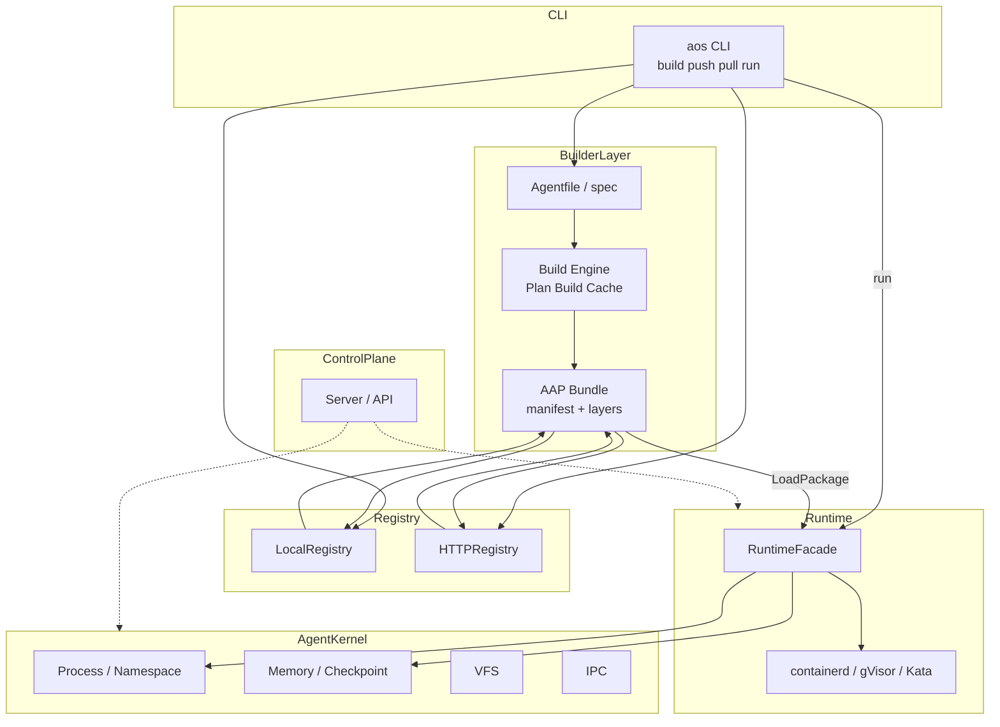

<p align="center">
  
</p>

<h1 align="center">OpenOS</h1>
<p align="center">
  <strong>一个以 Agent 为内核原生设计的应用操作系统。欢迎加入我们，一起探索与共创。
</strong>
</p>

<p align="center">
  <a href="https://github.com/deepelementlab/clawcode/releases">
   
  </a>
  <a href="#许可证"></a>
</p>

[English](README.md) | **简体中文**

OpenOS 致力于构建开放的 AOS（Agent Operating System，智能体操作系统），为长时运行的智能体工作负载提供从**定义到运行时**的完整闭环，覆盖从开发交付到生产运维的全生命周期。


AOS 将智能体生命周期拆成两条可独立演进的轨道——**构建与分发**、**运行与管理**——并通过单一、可移植的产物 **Agent Package（AAP）** 将二者衔接。

**1. 工程友好的智能体制品构建**  
通过声明式 Agentfile 描述元数据、构建步骤与多阶段构建，开发者可通过 `aos build` 产出标准化 AAP（Agent Package）。配合 `aos push` / `aos pull` 以及本地或 HTTP 镜像库，团队可进行版本管理与分发。系统支持依赖声明、包签名等机制，使智能体应用可以像云原生制品一样被构建、发布与追溯。

**2. 统一的运行时与管理环境**  
基于与 containerd、gVisor、Kata 等运行时对接的 RuntimeFacade，结合 Agent Kernel 对进程组、命名空间、内存与检查点、VFS、IPC 等的抽象，以及 `aos run` 与控制面服务，OpenOS 提供智能体的启动、隔离、生命周期与可观测性等管理能力，使「包」与「运行实例」可在统一的语义模型下运维。

---

## 设计理念

我们先定义**包是什么**，再定义**如何运行**。包（清单 + 层 + 映射规则）连接构建期与运行期，而不是把构建步骤硬编码进进程隔离，反之亦然。

|       轨道       |       目标        |  示例 |
|-------------------|---------------------|-----------|
| **构建与分发** | 将智能体应用变成可版本化、可寻址、可复用的单元 | internal/builder/spec、engine（Plan / Build、多阶段与 DAG）、registry（本地 / HTTP）、依赖 |
| **运行与管理** | 在主流运行时上以隔离的、内核感知的负载运行智能体 | pkg/runtime/facade、internal/kernel（进程 / 内存 / vfs / ipc）、cmd/aos run、internal/server 与控制面相关包 |

### 1. 构建与分发

#### a. 声明式优先

Agentfile（JSON/YAML）承载 apiVersion、元数据、steps/stages、依赖等。构建计划由 spec → Plan 推导，而非硬编码在 CLI 中。

**实现：** `internal/builder/spec` 定义模式；`engine.Plan` / `PlanMultiStage`、拓扑排序与并行阶段将「意图」转化为可计算、可缓存的层哈希与阶段摘要。

**核心思想：** 智能体交付物应可评审、可 diff、可接入 CI，与「临时脚本」划清界限。

#### b. 包即契约

产出为 AAP（manifest.json、layers.json 等）。配合 Registry 的 push/pull，团队内的「单一事实来源」是制品与版本，而不是某台机器上的目录。

**实现：** `engine.WriteLocalAAP`、`registry.LocalRegistry` / `HTTPRegistry`、`LoadAgentPackage`。

**核心思想：** 运维与协作以制品为边界；运行环境只消费契约，不重复实现构建逻辑。

#### c. 安全与信任边界（可选但结构化）

签名（例如 registry/crypto、signature.json）将来源与完整性纳入同一制品模型，而不是事后补丁。

**核心思想：** 分发与生产之间的信任链产品化，不只依赖网络隔离。

#### d. 内容寻址层

层哈希、缓存目录（例如 LayerCache）、多阶段 From / dependsOn，与多阶段构建 + 层复用的直觉一致（类容器镜像）。

**实现：** 在 engine 中按 step/stage 计算摘要、DAG 并行执行钩子、缓存元数据（含与 Kernel 检查点对接的扩展点）。

**核心思想：** 构建加速与可复现性依赖可哈希单元，而非某台构建机的状态。

### 2. 运行与管理

#### a. 运行时与内核分层

RuntimeFacade 负责通过 CreateAgent、StartAgent 等与「容器 / 沙箱世界」（如 containerd、gVisor、Kata）对接。

Kernel Facade 负责「Agent OS 语义」：进程组、命名空间、内存区域与检查点、VFS、IPC，与具体容器实现解耦。

**实现：** `pkg/runtime/facade` + `WithKernel`；`internal/kernel` 下各子系统；`aos run` 拉取包 → 解析 manifest → 在 CreateAgent 时挂接 Kernel。

**核心思想：** 容器运行时解决「如何跑容器」；Kernel 层表达「如何把智能体作为系统资源管理」。二者组合，而非揉成单一运行时大块。

#### b. 单一入口、多种后端（Facade + 可插拔后端）

运行时使用工厂 + 接口（`interfaces.Runtime`）切换实现；CLI/API 侧通过 Facade 收敛调用路径。

**核心想法：** 可替换后端与可测试性（例如 mock/noop 在 gRPC 等路径也存在），避免控制面绑定某家运行时。

#### c. 从包到进程的显式映射（AAP → AgentSpec）

`LoadAgentPackage` + `AgentSpecFromPackage`（`pkg/runtime/facade/package.go`）将清单中的 config/entrypoint 映射到 `types.AgentSpec`，再传给 Connect / CreateAgent。

**核心思想：** 运行参数来自制品，避免运行期隐式猜配置，利于审计与可复现。

### 3. 闭环

路径 `aos build` → Registry → `aos run`（以及更广的控制面）体现以包驱动的智能体 OS：

- 构建产出唯一制品；
- Registry 提供寻址与分发；
- 运行时在 Kernel + Runtime 的双重能力上消费同一清单与层。

构建（定义 + 构建 + 分发）与运行（隔离 + 生命周期 + 可观测性）在设计上对称、可追溯、可自动化，交付「以制品驱动的 Agent OS」。

---

## 关键能力

AOS 将**声明式智能体包**（构建 → 镜像库）与**运行时及内核级执行**结合，使智能体可在统一的控制面模型下**打包、分发与运行**。

| 领域 | 能力 | 你能得到什么（有实现支撑） |
|------|------------|----------------------------------------|
| **CLI** | 统一的 `aos` 工具 | `build`、`push`、`pull`、`run`（以及 `cmd/aos` 下的 `server` 等），用于制品与控制面工作流。 |
| **智能体包** | 声明式 **Agentfile** | JSON/YAML 清单（`internal/builder/spec`）：元数据、`steps`、多阶段 **`stages`**、`from` / `dependsOn`、依赖、config、entrypoint。 |
| **构建引擎** | Plan → 构建 → AAP | 内容寻址层摘要、**多阶段**计划、**DAG** 排序的阶段与并行钩子（`internal/builder/engine`）。输出 **AAP** 布局（`manifest.json`、`layers.json` 等）。 |
| **构建缓存** | 层缓存 | 基于文件系统的**层缓存**，分片路径与裁剪（`internal/builder/engine` 中的 `LayerCache`）。 |
| **检查点（构建路径）** | 与内核集成的元数据 | 在使用内核测试/构建钩子时，可选地将**内存检查点** ID 附在缓存元数据上（`checkpoint.go`、`MemoryManager`）。 |
| **Registry** | 本地 registry | 根目录下的文件存储与索引（`internal/builder/registry`）。 |
| **Registry** | HTTP registry | HTTP 上的 push/pull，可选 **Bearer** 令牌（`internal/builder/registry/remote.go` 中的 `HTTPRegistry`）。 |
| **信任** | 包签名 | **Ed25519** 签名/验签与 `signature.json` 旁路文件（`internal/builder/registry/crypto.go`）。 |
| **依赖** | 解析器 | 在内存中解析 `DependencySpec`（带 `ref` 的智能体、服务、卷等）（`internal/builder/deps`）。 |
| **运行时门面** | 运行时的单一入口 | **`RuntimeFacade`**：后端选择、`Connect`、`CreateAgent`、`StartAgent`、可选 **`WithKernel`**（`pkg/runtime/facade`）。 |
| **运行时后端** | 可插拔运行时 | `pkg/runtime/` 下的 **containerd**、**gVisor**、**Kata** 包，共享 `interfaces` 与 `types`。 |
| **智能体映射** | AAP → `AgentSpec` | **`AgentSpecFromPackage`** 将清单映射为用于创建/启动的 `types.AgentSpec`（`pkg/runtime/facade/package.go`）。 |
| **Agent 内核** | 类 OS 原语 | **进程**（组、命名空间）、**内存**（区域、检查点/恢复桩）、**VFS**、**IPC**（`internal/kernel/*`），由 **`kernel.Facade`** 聚合。 |
| **控制面** | HTTP 与 gRPC API | 服务装配（`internal/server`）、**gRPC** 服务与 **protobuf**（`api/grpc`、`api/proto`），可选 **gRPC-Gateway**。 |
| **平台能力** | 多租户与运维 | 调度、编排、消息（如 **NATS**）、发现、租户/配额、可观测性钩子——见 `internal/` 子系统（与 `go.mod` 依赖对齐）。 |
| **持久化与缓存** | 数据栈 | **PostgreSQL**（`lib/pq`、`sqlx`）、**Redis**、存储抽象（`internal/database`、`internal/storage`）。 |
| **CI 与质量** | 自动化 | **GitHub Actions**、带 race 与覆盖率的测试、可选 **Codecov**；**关键包覆盖率**脚本（`scripts/coverage-key-packages.sh` / `.ps1`）。 |

---

## 系统架构

OpenOS 可描述为**五个逻辑层**，外加显式的**薄数据层**与**双状态机**（控制 vs 一致性）。下图在 GitHub 上可正常渲染（Mermaid）。



---

## 设计原则

1. **API 优先** — 面向 OpenAPI/gRPC 的契约、统一错误、幂等键、`/api/v1/...` 风格版本化。
2. **以智能体为中心** — 调度与生命周期围绕智能体，而非交互式用户。
3. **安全内建** — 租户、配额、隔离（命名空间/cgroups/沙箱）为一等概念。
4. **云原生** — 容器、水平扩展模式、默认可观测（事件中带 `trace_id`、`agent_id`、`tenant_id`）。
5. **治理** — 能力以 **Target / IterationScope / Implemented** 跟踪并附证据——而非一厢情愿的标签。

**ADR（示例）：** MVP 采用进程内网关，并保留通往 Envoy 的路径；消息以 **NATS 优先**，可选 JetStream。

---

## 仓库结构

```text
├── cmd/aos/                 # aos CLI：控制面服务、build、push、pull、run 等
├── api/                     # 对外 API 表面
│   ├── gateway/             # HTTP 网关入口
│   ├── grpc/                # gRPC 服务与生成的 protobuf 代码（pb）
│   ├── proto/               # Protobuf 定义与 buf 配置
│   ├── handlers/            # HTTP/gRPC 处理器
│   ├── middleware/          # 横切关注点（认证、租户、审计等）
│   ├── auth/                # API 层认证辅助
│   ├── models/              # 请求/响应模型
│   ├── routes/              # 路由注册
│   └── specs/               # API 规范（如 OpenAPI）
├── internal/                # 非导出应用与领域逻辑
│   ├── server/              # HTTP 服务装配、路由、中间件栈
│   ├── config/              # 配置加载
│   ├── agent/               # 智能体生命周期及相关逻辑
│   ├── scheduler/           # 调度（亲和性、算法、故障转移等）
│   ├── orchestration/       # 工作流、saga、状态机
│   ├── messaging/           # 消息、NATS 集成、事件总线
│   ├── discovery/           # 服务发现与负载均衡
│   ├── tenant/              # 多租户与配额
│   ├── database/            # 数据库连接、迁移、重试
│   ├── storage/             # 存储抽象
│   ├── auth/                # 内部令牌与认证工具
│   ├── security/            # 策略（如 OPA）、供应链等
│   ├── monitoring/          # 指标与可观测性辅助
│   ├── observability/tracing/  # 分布式追踪
│   ├── health/              # 健康聚合
│   ├── resource/            # 资源管理
│   ├── network/             # 网络策略
│   ├── deployment/          # 部署流水线相关逻辑
│   ├── federation/          # 联邦 / 类 registry 扩展
│   ├── resilience/          # 探针与弹性模式
│   ├── slo/                 # SLO 相关逻辑
│   ├── autoscaling/         # 自动扩缩容
│   ├── capacity/            # 容量规划
│   ├── prediction/          # 故障预测与相关分析
│   ├── governance/          # 计费与治理类事项
│   ├── edge/                # 边缘相关扩展 / 占位
│   ├── ml/                  # ML 相关扩展 / 占位
│   ├── validation/          # 压测/验证工具
│   ├── audit/               # 审计
│   ├── data/                # 内部数据辅助
│   ├── version/             # 构建/版本元数据
│   ├── kernel/              # Agent 内核：进程、内存、vfs、ipc
│   └── builder/             # Agent 包：spec、engine、registry、deps、集成测试
├── pkg/                     # 可导入库（稳定 API 意图因包而异）
│   ├── runtime/             # 容器运行时抽象与后端
│   │   ├── facade/          # RuntimeFacade（统一入口、AAP 映射辅助）
│   │   ├── interfaces/      # 运行时接口
│   │   ├── types/           # 共享运行时类型
│   │   ├── containerd/      # containerd 后端
│   │   ├── gvisor/          # gVisor 后端
│   │   ├── kata/            # Kata 后端
│   │   ├── sandbox/         # 沙箱与网络隔离
│   │   ├── lifecycle/       # 生命周期钩子
│   │   └── resource/        # 运行时资源强制
│   └── packaging/           # 清单与打包辅助
├── test/                    # 跨包测试
│   ├── integration/         # 集成测试
│   ├── e2e/                 # 端到端测试
│   ├── smoke/               # 冒烟测试
│   ├── benchmarks/          # 基准测试
│   └── data/                # 测试夹具
├── scripts/                 # 工具脚本（如覆盖率辅助）
├── configs/                 # 示例或默认配置
├── docs/                    # 文档（含 OpenAPI 资源）
├── sdk/go/                  # Go 客户端 SDK（或桩）
├── data/                    # 本地/示例数据目录
├── bin/                     # 构建输出目录（若存在）
├── .github/                 # CI 工作流与复合动作（如 build-agent）
├── .devcontainer/           # 开发容器配置
├── go.mod / go.sum          # Go 模块定义
└── coverage*                # 本地覆盖率产物（通常 gitignore）
```

---

## 技术栈

| 层级 | 技术 |
|--------|----------------|
| 语言 | **Go** 1.22+ |
| API | **gRPC**、**grpc-gateway**（可选 REST 桥接）、HTTP（`net/http` / server 包） |
| 数据 | **PostgreSQL**（sqlx）、**Redis** 客户端（缓存/会话类配置） |
| 消息 | **NATS**（`nats.go`） |
| 运行时 | 树内 **containerd**、**gVisor**、**Kata** 方向 |
| 可观测性 | Zap 日志；设计文档中的 Prometheus 风格钩子 |
| CLI | **Cobra**、**Viper** |

---

## 快速开始

在本地构建并运行**参考实现**（`agent-os/implementation`）。

### 前置条件

| 要求 | 说明 |
|---------------|--------|
| **Go** | 1.22 或更高（[下载](https://go.dev/dl/)） |
| **GNU Make** | 可选；用于 `Makefile` 快捷命令 |
| **后端服务** | 部分测试与生产配置依赖 **PostgreSQL**、**Redis** 和/或 **NATS** —— 请按你的环境调整 `configs/config.yaml` 或环境变量 |

### 构建

在仓库根目录：

```bash
cd agent-os/implementation
go mod download
make build    # 输出 bin/aos
```

使用 Make 时的交叉编译快捷命令：`make build-linux`、`make build-darwin`、`make build-windows`。

### 运行

将二进制指向示例配置，并按环境调整数据存储与消息：

```bash
./bin/aos --config configs/config.yaml
```

若尚未先执行构建，等价于：

```bash
go run ./cmd/aos --config configs/config.yaml
```

### 测试

```bash
# 全模块（贡献前建议执行）
go test -race ./...

# Makefile 快捷（选定包）
make test
```

> **说明：** 连接相关失败通常表示所需服务未启动，或 `test` / `e2e` 包期望特定主机 —— 请查看失败的包以及本地的 Postgres/Redis/NATS 端点。

### Lint、覆盖率与其他目标

```bash
make lint
make coverage
make run
```

完整目标列表见 [`agent-os/implementation/Makefile`](agent-os/implementation/Makefile)。

### 发布 implementation 目录（可选）

将整个 `implementation/` 项目复制到其他目录（用于打包或部署）：

**Windows（PowerShell）**

```powershell
cd agent-os/scripts
.\publish-implementation.ps1 -Destination "D:\path\to\release"
# 可选：-Clean（先清空目标）、-IncludeParentFolder、-UseMirror（robocopy /MIR）
```

**Linux / macOS**

```bash
chmod +x agent-os/scripts/publish-implementation.sh   # 仅需一次
./agent-os/scripts/publish-implementation.sh /path/to/release
# 可选：-c（清空目标子树）、-p（保留 implementation/ 父文件夹）
```


---

## 新增能力

- 智能体构建 / 组装 / 定制。

- 系统核心运行时抽象。

- 标准化智能体交付 —— 类似基于 Docker 镜像的容器交付。

- 可复用智能体组件 —— 模板继承 + 依赖复用。

- CI/CD 集成 —— 智能体构建可接入 DevOps 流水线。

- 版本管理 —— 可版本化、可追溯的智能体制品。

---

## 贡献

欢迎提交 Issue 与 Pull Request。提交前请运行 **`go test -race ./...`**（若使用 golangci-lint 则再运行 `make lint`）。较大行为变更时，请在适当时与 ADR 或架构说明对齐。

---

## 许可证

GPL-3.0
